# Despliegue de Aplicaciones Web (CIP_DAW_DPL) - Pruebas Unitarias y Análisis de Código 
## Testing of web application deployment course - DevOps! _by   javi2gar (vernedevelop)  
## Versión 0.2.0     

## [Instrucciones de las prácticas a entregar](https://github.com/javi2gar/calculadora-php/blob/master/README_FILES/INSTRUCCIONES.md).

- [¡Enlace al repositorio _GitHub_ **_Calculadora-php_**!](https://github.com/javi2gar/calculadora-php).  

- [¡Enlace a los test en **_SonarCloud_** _Calculadora-php_ desplegada en _DockerHub_!]().  

- [¡Enlace al proyecto en **_Travis-CI_** _Calculadora-php_ !](https://travis-ci.org/javi2gar/calculadora-php)

## Pasos de la práctica  

### _Estructura incial del proyecto_ ###
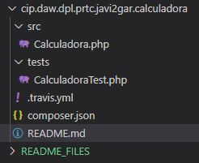

**Versión 0.1.0**	
> - src/Calculadora.php: Declaración de la clase Calculadora. La clase debe estar vacía.
> - test/CalculadoraTest.php: Declaración de la clase CalculadoraTest. La clase debe estar vacía.
> - .travis.yml: Fichero de configuración de integración continua con Travis.
> - composer.json: Fichero Composer con las dependencias del proyecto.

#### 1. Creamos el repositorio en _GitHub_

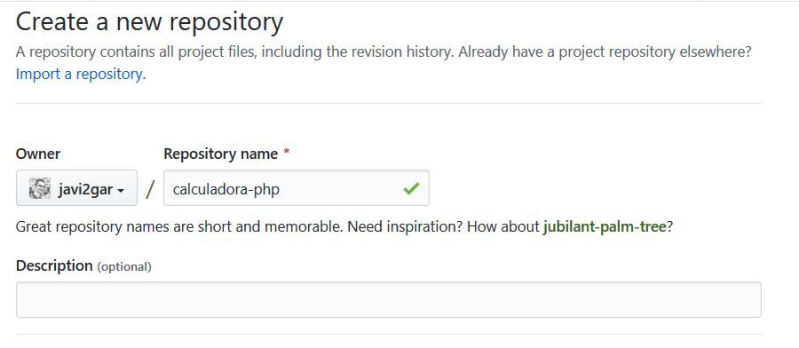

#### 2. Creamos el proyecto en _Git_ (local) - por medio de la Bash

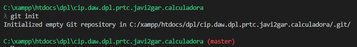

>	
	git init

#### 3. Creamos el proyecto en _Git_ (local) - por medio de la Bash

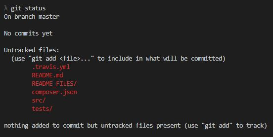

>	Comprobamos el estado de nuestro proyecto

	git status

>	Añadimos todo con el . a nuestra _Staging Area_ (salvo si le hemos indicado que no añada lo especificado en el _.gitinore_)

	git add .

>	Realizamos el commit inicial 

	git commit -m "Versión 0.1.0"

>	Etiquetamos el commit y la versión 

	git tag v0.1.0 -m "Versión inicial"

#### 4. GitHub

>	Añadimos el repositorio remoto en _**GitHub**_ que hemos creamos previamente llamado _**calculadora-php**_ 

	git remote add origin git@github.com:javi2gar/calculadora-php.git

>	Enviamos los cambios al repositorio remoto (por primera vez)  

	git push -u origin master

>	Enviamos la etiqueta que hemos creado 

	git push --tags

#### 5. Preparamos el _composer.json_ , añadimos las dependencias necesarias para realizar análisis de código y pruebas unitarias 

> Añadiremos la dependencia _buildpack_ necesaria para desplegar posteriormente en _**Heroku**_), así como automatización de tareas con _**Phing**_ (crearemos de manera automática test y carpetas para recoger las pruebas en local,  _/reports_ ). Integraremos además el _**SonaCloud**_ para registrar los cambios en la nube en lugar de usar _**SonarQube**_ (necesitaremos el _**SonaScanner**_)
	>- _phpunit.xml_ (Archivo de configuración de _**PHPUnit**_)
	>- _phpcs.xml_ (Archivo de configuración de _**PHPCS**_ - _PHP CodeSniffer_)
	>- _build.xml_ (Archivo de configuración de _**Phing**_)
    "Nos enviarán los resultados a la carpeta /reports"

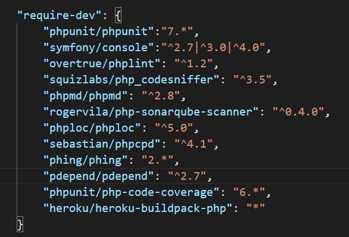

>	Instalamos las dependencias declaradas en el _**composer.json**_ 

	composer install

#### 6. Comenzamos a crear las ramas (_branch_) _feature/x_ para cada nueva caracteríastica.

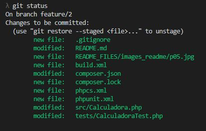

> Quedaría algo así

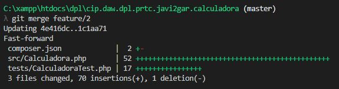

### PHPUnit - Pruebas Unitarias

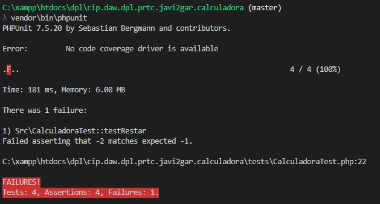

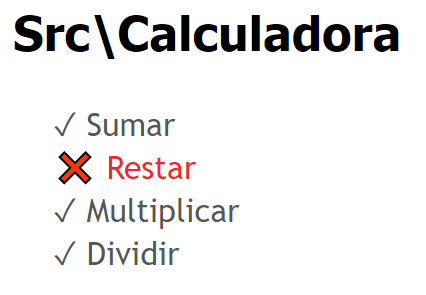

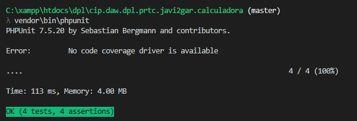

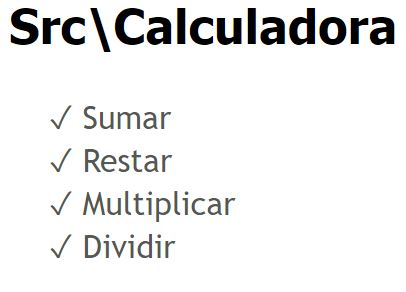

### PHPCodeSniffer 

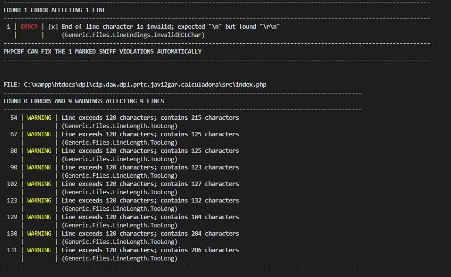

### Heroku + SonarCloud

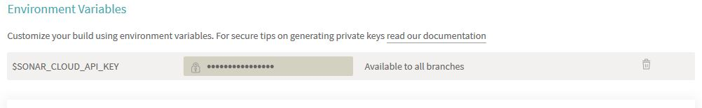

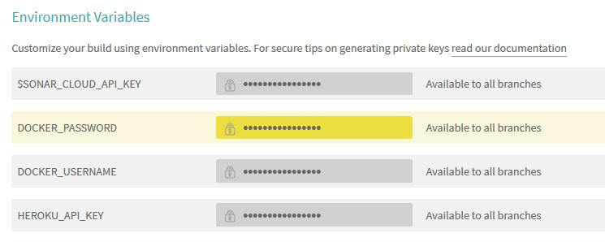

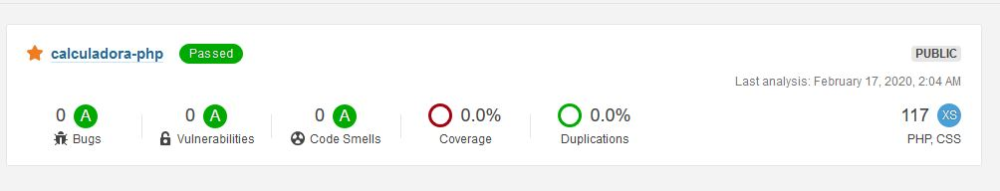

### Heroku
> Creamos un repositorio en Heroku con nuestra cuenta y desplegamos desde Travis

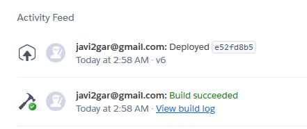

### DockerHub
> Desplegamos desde Travis

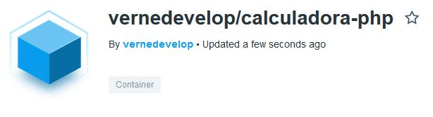

